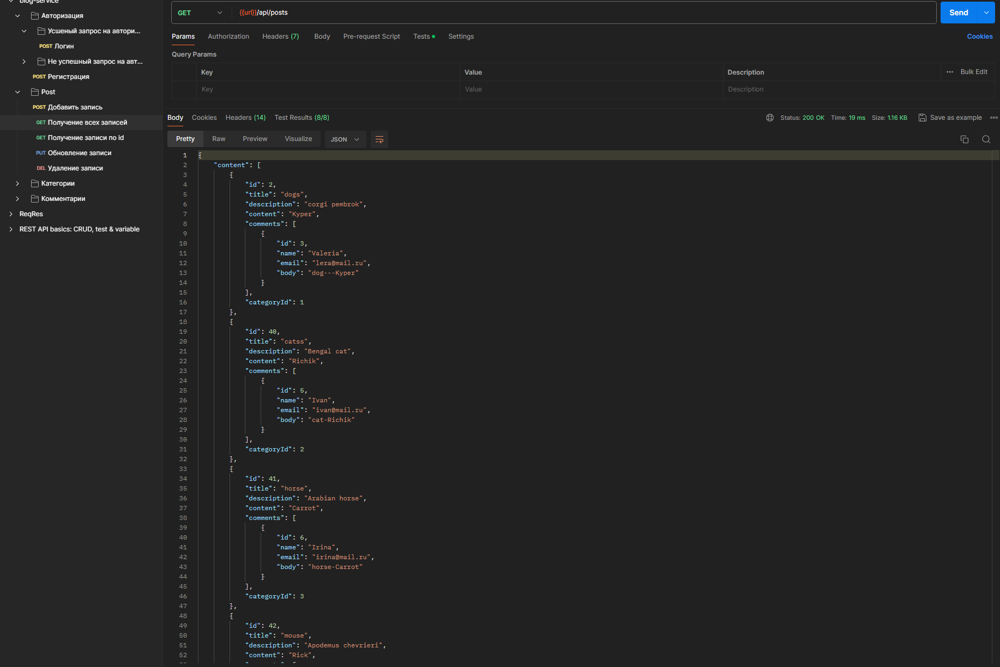
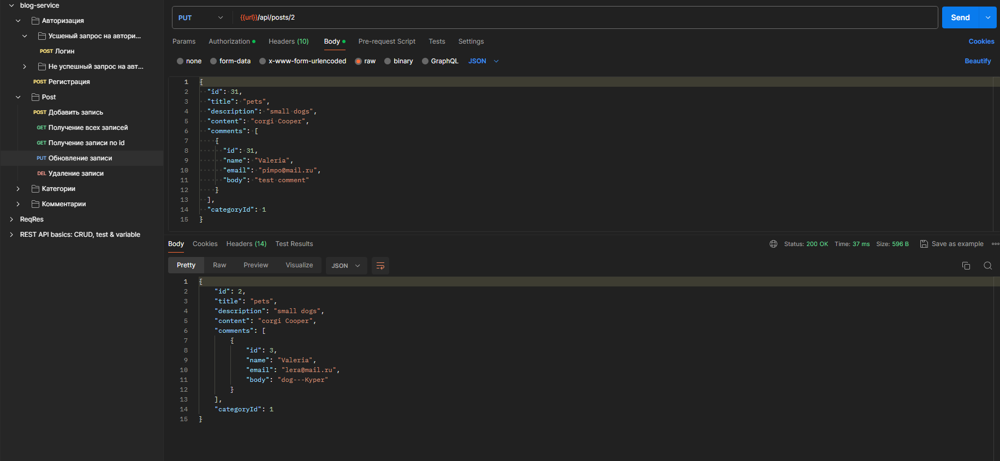
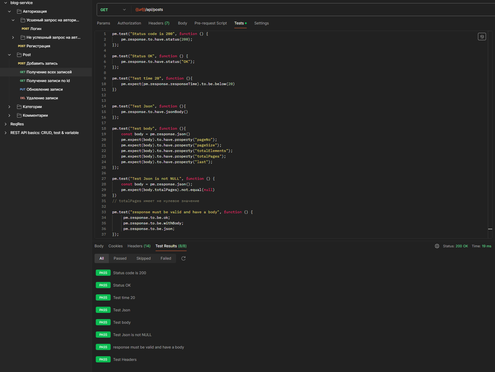

# Проект с ручными и автоматизированными тестами для [blog-rest-service](https://github.com/RameshMF/springboot-blog-rest-api) 

# 
Описание проекта

  
В данном проекте можно увидеть реализацию ручных и автоматизированных тестов при помощи использованися **Postman** для сервиса [Blog App](https://github.com/RameshMF/springboot-blog-rest-api) ***REST API***   сервиса.
    
        
## :computer:  Используемые технологии и инструменты

Для ручного тестирования и написания автоматизированных тестов был использован `Postman` \
`Java` - язык программирования на котором написано тестируемое приложение \
`Swagger` - для получения API работы с сервисом \
`Idea intellij` - для локального запуска приложения \
`MySQL` - СУБД работающая с тестируемым приложением \
`Dbeaver` - для работы с СУБД `MySQL`

## Локальный запуск приложения

Для локально запуска приложения, необходимо запустить СУБД MySQL, а после этого скомпилировать и запустить само Java приложение. 

## Пример запросов к сервису

## Пример автоматизированных тестов к сервису

 